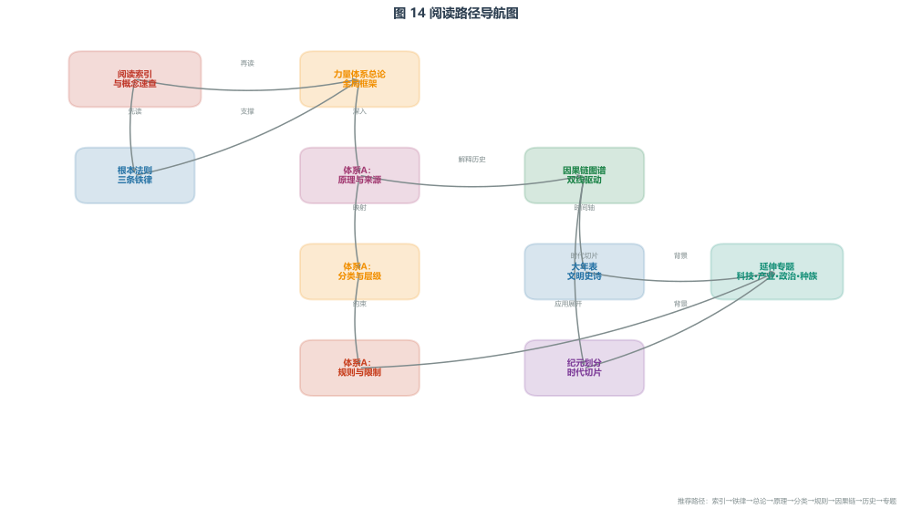

# 阅读索引与概念速查

> 本文档是进入本设定集的前置入口。建议所有首次阅读者先浏览本页，再按推荐路径深入各章节。本页不讲述故事，只提供"阅读地图"和"基础概念工具包"。

---

## 一、推荐阅读路径

本设定集不是按时间顺序展开的小说，而是按"逻辑层级"组织的世界观手册。如果你按目录顺序从前往后读，可能会在大年表、纪元划分等章节中遇到尚未解释的专业术语。以下是两条推荐路径：

## 一、推荐阅读路径

  
  

    阅读路径导航图：从索引和铁律出发，进入力量体系总论与三层技术，再经因果链进入历史与专题。
  

### 路径 A：因果优先（推荐）
适合想理解"这个世界为什么是这样"的读者。

1. [项目宪章](00_项目宪章.md) —— 了解本项目的核心原则与边界。
2. [根本法则](../01_世界核心/03_根本法则.md) —— 三条世界铁律 + Ξ 场三公理，一切设定的物理与法理地基。
3. [力量体系总论](../08_力量体系/01_力量体系总论.md) —— 魔法不是超自然，而是特定物理机制的应用；三层体系概览。
4. [体系A：原理与来源](../08_力量体系/02_体系A/01_原理与来源.md) —— f 函数、n 点、蓄势弹簧效应、复杂度解离的物理细节。
5. [体系A：规则与限制](../08_力量体系/02_体系A/02_规则与限制.md) —— 三层体系各自的代价、边界与危险。
6. [因果链图谱](../03_历史与年表/04_因果链图谱.md) —— 理解历史不是单线由 f 周期决定，而是"物理环境线"与"组织复杂度线"双线交错。
7. [大年表](../03_历史与年表/01_大年表.md) —— 此时再读，所有术语和逻辑框架都已建立。

### 路径 B：故事优先
适合想先看文明史诗、再回头补设定的读者。

1. [纪元划分](../03_历史与年表/02_纪元划分.md) —— 快速了解八个时代。
2. [大年表](../03_历史与年表/01_大年表.md) —— 但建议同时打开本页的"基础概念速查表"，遇到不明术语随时回查。
3. [力量体系总论](../08_力量体系/01_力量体系总论.md) —— 读完历史梗概后，回头理解魔法机制。
4. [根本法则](../01_世界核心/03_根本法则.md) —— 最后理解底层铁律。

---

## 二、基础概念速查表

以下术语会出现在几乎所有章节中。建议先读一遍，不求记住，但求"有印象"。

| 术语 | 一句话解释 | 深入阅读位置 |
|------|-----------|------------|
| **Ξ 场** | 一种物理场，能够放大能量转化效率，让特定振动系统产生超额做功。它不是魔法，是本世界的物理机制。 | [力量体系总论](../08_力量体系/01_力量体系总论.md) |
| **n 点 / n 值** | 描述一个振动系统的"复杂度状态"。n 值越高，系统越复杂。人体、机器、大脑都有各自的 n 值。 | [体系A：原理与来源](../08_力量体系/02_体系A/01_原理与来源.md) |
| **o 基准点** | n = 1000 的基准复杂度阈值。超过此点，Ξ 效应效率骤降、损耗暴增。它是整个体系的安全天花板。 | [根本法则](../01_世界核心/03_根本法则.md) |
| **f 函数 / f 分布** | 描述环境中 Ξ 场转化效率随 n 值变化的曲线。曲线有波峰，波峰位置由环境决定。 | [体系A：原理与来源](../08_力量体系/02_体系A/01_原理与来源.md) |
| **f 中心** | f 曲线波峰所在的 n 值位置。它随时间缓慢漂移，是历史的"物理节拍器"。 | [体系A：原理与来源](../08_力量体系/02_体系A/01_原理与来源.md) |
| **f 周期 / f 漂移** | f 中心在数轴上的长期移动。不是单一周期，而是多尺度叠加 + 混沌微扰。它决定了 Ξ 通讯和 Ξ 工具在何时高效、何时失效。 | [体系A：原理与来源](../08_力量体系/02_体系A/01_原理与来源.md) |
| **蓄势弹簧效应** | 当系统从低 n 向 o 点趋近时，Ξ 场推动系统做功；系统远离 o 点时，结构势能重新积累。这是 Ξ 效应做功的核心机制。 | [体系A：原理与来源](../08_力量体系/02_体系A/01_原理与来源.md) |
| **复杂度解离** | Ξ 推动的代价。每一次做功都会消耗载体的结构有序性，导致机械疲劳、组织损伤或神经损伤。 | [体系A：规则与限制](../08_力量体系/02_体系A/02_规则与限制.md) |
| **副发声器官** | 人类在 f 中心位于人体范围内时用于 Ξ 通讯的本能器官。可传递情绪、意图和危险预警。 | [种族A：生理与特性](../04_种族与生物/02_种族A/01_生理与特性.md) |
| **声带语言** | 人类在 f 偏离期间发展出的声学语言系统。即使在 f 回归后，也因组织复杂度不可逆而保留下来。 | [语言文化桥梁](../05_文化与社会/01_语言文化桥梁.md) |
| **第一层（机械振子）** | 以机械振动系统为载体的 Ξ 工具。复杂度 n ≈ 200–400。 | [力量体系总论](../08_力量体系/01_力量体系总论.md) |
| **第二层（转译接口）** | 以双 n 点系统 + 意念编码为载体的 Ξ 工具。复杂度 n ≈ 400–700。 | [力量体系总论](../08_力量体系/01_力量体系总论.md) |
| **第三层（内源施法）** | 以大脑神经集群为载体的 Ξ 效应。复杂度 n ≈ 850。最自由，也最危险。 | [力量体系总论](../08_力量体系/01_力量体系总论.md) |
| **人工 f 塔** | 依托行星 f 曲线波峰、通过多塔联合调制产生私有效率峰的战略防御设施，专门威慑第三层施法者。 | [科技与工艺](../07_经济与技术/03_科技与工艺.md) |

---

## 三、核心数字速记

以下数字会在历史和技术章节反复出现，提前建立锚点：

- **n = 1000**：o 基准点，Ξ 效应安全上限。
- **n ≈ 200–400**：第一层机械振子有效区间。
- **n ≈ 400–700**：第二层转译接口有效区间。
- **n ≈ 850**：第三层大脑施法危险区间。
- **f 中心 ≈ 300**：帝国早期稳定位置，对应人体舒适度区。
- **f 中心 ≈ 450–550**：帝国中晚期，旋钮和材料工程开始承压。
- **f 中心 ≈ 750**：战国早中期，大脑可产生可测量 Ξ 信号。
- **f 中心 ≈ 850**：战国中后期，大脑直驱进入危险可行区。
- **死亡率 ≈ 70%**：第三层传承体系早期训练死亡率。

---

## 四、双线驱动：理解历史的核心框架

本世界历史不是"f 周期决定了文明"，而是两条独立线索交错的结果：

1. **物理环境线（f 周期）**：f 中心在数轴上漂移，决定 Ξ 通讯和 Ξ 工具在物理上是否可行、效率多高。
2. **组织复杂度线（文明自身）**：群体规模、分工精细度、代际知识传递需求。这条线不可逆。

两条线交错，产生关键历史节点：
- 语言独立：f 偏离推动，组织复杂度保留。
- 第一层工具化：f 回归 + 帝国规模需求。
- 第二层突破：f 漂移 + 战争/生产需求 + 神秘生物启发。
- 第三层诞生：f 逼近大脑 + 第二层神经控制经验积累。
- f 塔网络：施法者威胁 + 多塔联合调制技术。

详细论述见 [因果链图谱](../03_历史与年表/04_因果链图谱.md)。

---

## 五、常见误读澄清

| 误读 | 正解 |
|------|------|
| "Ξ 场是魔法能量" | Ξ 场是物理场，不创造能量，只放大转化效率。 |
| "f 周期是固定轮回" | f 周期是多尺度叠加 + 混沌微扰，不是精确可预测的正弦波。 |
| "f 回归会让语言消失" | 不会。组织复杂度不可逆，声带语言一旦承担社会运转功能就不会被替代。 |
| "第三层魔法师是最强战斗单位" | 直接战斗是低效浪费。魔法师的价值在于设计编码、训练他人、执行特殊任务。 |
| "f 塔能压制所有施法者" | 不能。它只能提高施法者的环境风险，迫使对方进行场探和谨慎决策。 |

---

## 六、文件导航索引

| 主题 | 入口文件 |
|------|---------|
| 世界观地基 | [根本法则](../01_世界核心/03_根本法则.md) |
| 魔法体系总览 | [力量体系总论](../08_力量体系/01_力量体系总论.md) |
| 物理原理 | [体系A：原理与来源](../08_力量体系/02_体系A/01_原理与来源.md) |
| 规则与代价 | [体系A：规则与限制](../08_力量体系/02_体系A/02_规则与限制.md) |
| 分类与层级 | [体系A：分类与层级](../08_力量体系/02_体系A/03_分类与层级.md) |
| 历史双线框架 | [因果链图谱](../03_历史与年表/04_因果链图谱.md) |
| 文明史诗 | [大年表](../03_历史与年表/01_大年表.md) |
| 时代分期 | [纪元划分](../03_历史与年表/02_纪元划分.md) |
| 技术工艺 | [科技与工艺](../07_经济与技术/03_科技与工艺.md) |
| 政治组织 | [传承体系与魔法社团](../06_政治与势力/传承体系与魔法社团.md) |
| 种族生理 | [种族A：生理与特性](../04_种族与生物/02_种族A/01_生理与特性.md) |

---

> 阅读提示：本设定集的每个核心文件顶部都包含一个"前置知识提示块"，标注阅读本章前建议先读哪些文件。如果你在某个章节感到突兀，请回到本页或查看该文件顶部的提示块，补完前置知识后再继续。
