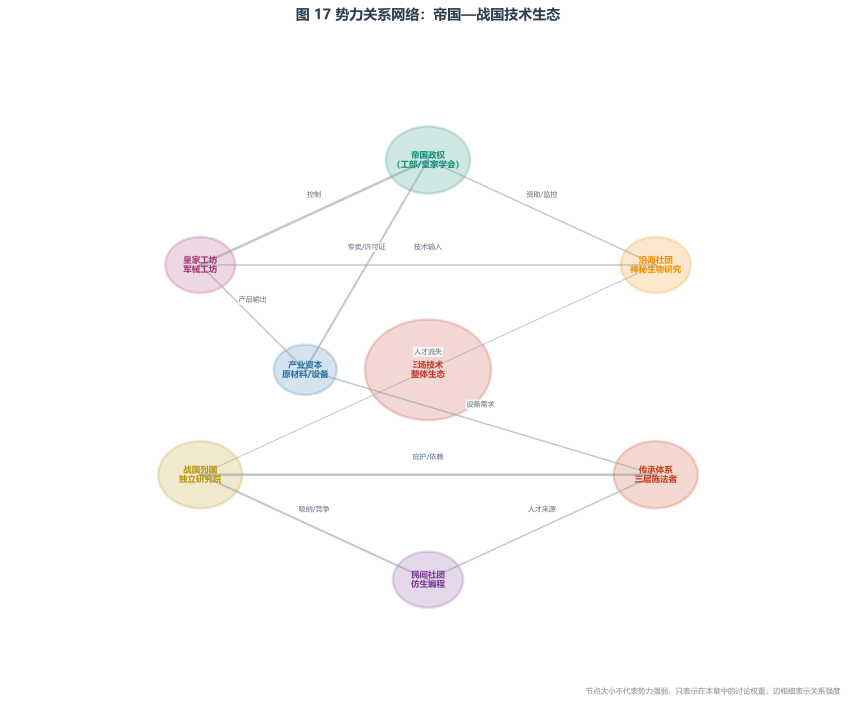

# 势力总览与关系图

> **前置知识提示**：阅读本章前，建议先读 [大年表](../03_历史与年表/01_大年表.md)、[纪元划分](../03_历史与年表/02_纪元划分.md) 和 [传承体系与魔法社团](传承体系与魔法社团.md)。本章按时代梳理势力，需要理解帝国时期、战国时期的政治与技术背景。
>
> **本章定位**：本文件梳理 Ξ 场技术体系中涉及的各类势力及其关系。它回答的问题是："不同时代有哪些关键组织，它们之间如何互动？" 传承体系的详细组织结构见 [传承体系与魔法社团](传承体系与魔法社团.md)，产业经济维度见 [产业与生产](../07_经济与技术/02_产业与生产.md)。

本文件梳理 Ξ 场技术体系中涉及的各类势力及其关系。传承体系的详细组织结构见 [传承体系与魔法社团](传承体系与魔法社团.md)，产业经济维度见 [产业与生产](../07_经济与技术/02_产业与生产.md)。

---

<div style="text-align:center; margin:1.5em 0;">
  
  <div style="font-size:0.85em; color:#555; margin-top:0.5em;">
    势力关系网络：帝国—战国 Ξ 技术生态中各组织的互动关系与资源流动。
  </div>
</div>

---

## 一、势力分类

### 帝国时期势力

| 势力 | 性质 | 核心资源 | 与 Ξ 技术的关系 |
|------|------|---------|----------------|
| 皇家学会 | 官方研究机构 | 知识垄断 | 集中整理经验知识，建立参数手册，理论研究核心 |
| 沿海研究社团 | 半官方研究团体 | 神秘生物数据 | 远洋考察，发现并研究 Ξ 场生物 |
| 皇家工坊 | 官方制造机构 | 核心工艺 | 垄断核心振子制造工艺 |
| 军械工坊 | 官方军工机构 | 武器级制造能力 | 制造武器级高能 Ξ 装置 |
| 专卖机构 | 官方资源机构 | 原材料配给权 | 统一配给高性能陶瓷前驱体粉末等关键材料 |
| 民间工坊 | 民用制造 | 低功率设备产能 | 生产民用 Ξ 泵、Ξ 加热器等低功率设备 |

### 战国时期势力

| 势力 | 性质 | 核心资源 | 与 Ξ 技术的关系 |
|------|------|---------|----------------|
| 各国 Ξ 场研究机构 | 官方研究机构 | 独立编码库 | 各国竞相建立，试图在接口技术上取得独立优势 |
| 各国传承体系 | 官方训练机构 | 安全神经路径 | 培养第三层施法者，国家级战略资源 |
| 民间编码社团 | 民间研究团体 | 独特编码技术 | 探索独特编码，偶尔产生突破 |
| 民间冒险社团 | 民间冒险团体 | 禁忌编码知识 | 冒险研究自主编码，死亡率极高 |
| 黑色产业链 | 非法组织 | "快速施法训练" | 提供非法施法训练，高致残率 |
| 远征队 | 官方/民间 | 新的生物解码范本 | 寻找新的 Ξ 场生物 |

---

## 二、势力关系矩阵

### 帝国时期关系

```
皇家学会 ──掌控──→ 皇家工坊 ──供应──→ 军械工坊
    │                    │
    │                    ↓
    │              专卖机构（原材料）
    │                    │
    ↓                    ↓
沿海研究社团        民间工坊（低功率设备）
（神秘生物数据）         ↑
    │                │
    └──数据共享──→ 皇家学会
```

**核心关系**：皇家学会是知识中枢，通过皇家工坊和军械工坊垄断高端制造，通过专卖机构控制原材料，允许民间工坊生产低功率设备。沿海研究社团提供神秘生物数据但受皇家学会指导。

### 战国时期关系

```
各国 Ξ 场研究机构 ──培养──→ 各国传承体系 ──产出──→ 施法者
       │                        │                    │
       │                        │                    ↓
       │                        │              f 塔网络（反制）
       │                        │
       ↓                        ↓
民间编码社团 ←─暗地收买─ 官方机构
       │
       ↓
民间冒险社团 ←─转型/衍生─ 民间编码社团
       │
       ↓
黑色产业链（快速施法训练）
```

**核心关系**：官方机构（研究机构+传承体系）是技术正统，民间编码社团在灰色地带运作，偶尔被官方暗地收买。民间冒险社团由编码社团转型或衍生，部分涉及黑色产业链。f 塔网络作为官方基础设施，反制敌方施法者。

---

## 三、势力间的核心矛盾

### 帝国时期矛盾

| 矛盾双方 | 矛盾核心 | 结果 |
|----------|---------|------|
| 中央 vs 地方总督 | 武器级 Ξ 装置的控制权 | 中央严格管控，但末期失控 |
| 皇家学会 vs 民间 | 核心工艺的垄断与反垄断 | 帝国时期民间无法突破，末期随人才流失而扩散 |
| 沿海社团 vs 皇家学会 | 神秘生物数据的归属 | 半官方合作，但社团保留部分自主权 |

### 战国时期矛盾

| 矛盾双方 | 矛盾核心 | 结果 |
|----------|---------|------|
| 官方 vs 民间社团 | 第三层技术的合法性与创新 | 明面禁止，暗地收买 |
| 各国之间 | 编码标准与技术优势 | 设备互不兼容，军备竞赛 |
| 传承体系 vs 军事需求 | 保守训练 vs 急需施法者 | 传承体系倾向保守，军事需求催促加速 |
| 官方 vs 黑色产业链 | 非法施法训练的打击 | 监管困难，黑色产业链屡禁不止 |

---

## 四、势力的时间演化

| 时期 | 主导势力 | 核心变化 |
|------|---------|---------|
| 城邦时期 | 各地工匠 | 经验性发现，无组织 |
| 共和时期 | 跨城邦学者 | 经验知识公共化，初步分类 |
| 帝国时期 | 皇家学会+皇家工坊 | 体系化研究，技术垄断 |
| 帝国末期 | 人才流失中的各机构 | 技术扩散开始 |
| 战国早期 | 各国研究机构+民间社团 | 技术竞争，仿生编程生态 |
| 战国中后期 | 传承体系+f 塔运营方 | 第三层突破，战略闭环形成 |

> 各势力的详细组织结构，见 [传承体系与魔法社团](传承体系与魔法社团.md)。经济维度见 [产业与生产](../07_经济与技术/02_产业与生产.md)。

---

## 导航

- 传承体系与魔法社团 → [传承体系与魔法社团](传承体系与魔法社团.md)
- 产业与生产 → [产业与生产](../07_经济与技术/02_产业与生产.md)
- 力量与社会 → [力量与社会](../08_力量体系/05_力量与社会.md)
- 禁忌知识与危险力量 → [禁忌知识与危险力量](../08_力量体系/04_禁忌知识与危险力量.md)
