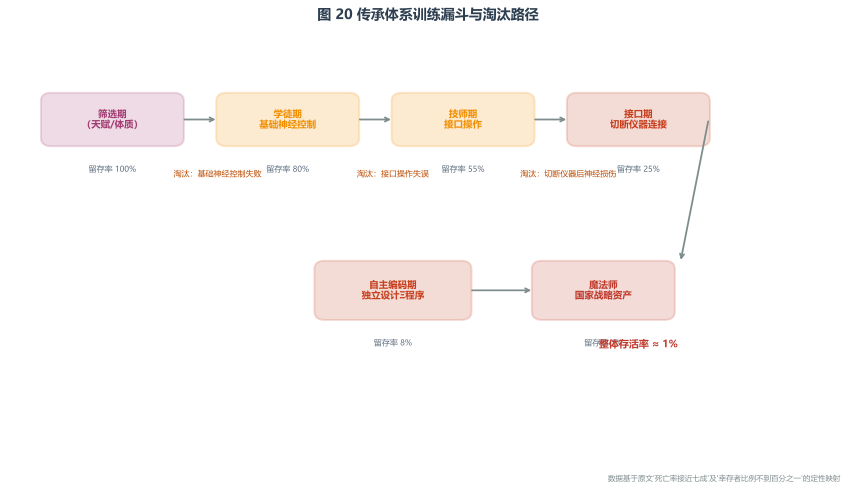

# 传承体系与魔法社团

> **前置知识提示**：阅读本章前，建议先读 [力量体系总论](../08_力量体系/01_力量体系总论.md)、[体系A规则与限制](../08_力量体系/02_体系A/02_规则与限制.md) 和 [体系A分类与层级](../08_力量体系/02_体系A/03_分类与层级.md)。本章将直接使用 "第三层施法""脑区耐受性""超线性解离""f 塔" 等概念。
>
> **本章定位**：本文件聚焦第三层施法技术的**政治与组织维度**——传承体系作为政治势力的组织结构、权力来源、派系关系，以及民间社团的政治角色。它回答的问题是："掌握最危险力量的人，如何在社会中组织起来？" 关于第三层施法的物理规则（脑区耐受性、安全窗口、超线性解离律），见 [体系A规则与限制](../08_力量体系/02_体系A/02_规则与限制.md)；关于三层技术的分类与历史演化，见 [体系A分类与层级](../08_力量体系/02_体系A/03_分类与层级.md)。

本文件聚焦第三层施法技术的**政治与组织维度**——传承体系作为政治势力的组织结构、权力来源、派系关系，以及民间社团的政治角色。关于第三层施法的物理规则（脑区耐受性、安全窗口、超线性解离律），见 [体系A规则与限制](../08_力量体系/02_体系A/02_规则与限制.md)；关于三层技术的分类与历史演化，见 [体系A分类与层级](../08_力量体系/02_体系A/03_分类与层级.md)。

---

  
  

    传承体系训练漏斗：从筛选到魔法师的每一步都有高淘汰率，最终存活率不足 1%。
  

---

## 一、传承体系的诞生背景

> **由浅入深**：第三层施法是人类历史上最危险的技术探索之一。它不像冶金或机械那样可以反复试错——每一次错误可能意味着神经损伤或死亡。那么，这种知识是如何传递下来的？它不可能写在公开教材里，也不可能靠个人天赋自发涌现。它必须依赖一种特殊的组织：以生命为代价验证边界、以师徒关系传递经验、以政治权力保护成员的传承体系。本章从这种组织的诞生背景讲起，解释它为什么不是学校，而是势力。

第三层技术的探索史是一段用生命书写的黑暗篇章。在战国早中期，不同国家的数十位研究者进行了自我实验，死亡率接近七成。幸存者中有相当一部分留下了永久性神经损伤。

正是这些牺牲者积累的数据，逐渐描绘出了第三层施法的物理边界。到了战国中后期，基于牺牲者积累的数据，成熟的传承体系开始形成——这不是一个教育机构，而是一个以生命为代价换来的、经过反复验证的安全知识体系。

> 第三层施法的物理规则（脑区耐受性、安全窗口、超线性解离律）见 [体系A规则与限制](../08_力量体系/02_体系A/02_规则与限制.md)。本文件聚焦传承体系作为政治势力的组织维度。

---

## 二、传承体系的组织结构

### 师徒制为核心

传承体系以教授经过反复验证的安全神经活动路径为核心，采用严格的师徒制：

| 训练阶段 | 时长 | 内容 | 淘汰机制 |
|----------|------|------|---------|
| 入门 | 3-5 年 | 最简单的安全编码（标准化"点亮"效果），感知神经活动状态 | 导师监护下的边界探测 |
| 进阶 | 5-8 年 | 更多编码序列，调用自动化运动记忆减少脆弱脑区参与 | 解离感出现时及时收手 |
| 独立施法 | 8 年以上 | 可独立执行已知安全编码 | 通过导师评估 |
| 魔法师 | 8 年+ 且比例<1% | 具备自主编码创新能力 | 极高淘汰率，幸存者即为战略资产 |

  
  

    第三层施法者训练漏斗：从入门学徒到魔法师，每一步都伴随高淘汰率。
    整体死亡率接近七成，能进行自主编码创新的魔法师比例不到百分之一。
    这种极端稀缺性是魔法师作为国家级战略资源的物质基础。
  

### 权力来源

传承体系的权力来源于三重垄断：

1. **知识垄断**：安全神经活动路径是经过数十年、数十位牺牲者的生命换来的数据积累，民间无法复制
2. **国家授权**：传承体系通常配属于国家研究机构或直属君主的特殊部队，享有官方背书
3. **人才垄断**：能进行自主编码创新的魔法师在整个训练群体中的比例不到百分之一，极度稀缺

### 配属关系

具备自主编码能力的魔法师因职业的高危险性与稀缺性，多作为国家级战略资源存在：

- **国家研究机构**：负责编码方案研发、新操作者训练
- **直属君主的特殊部队**：负责关键时刻只有内源施法才能完成的任务
- **不参与常规军事行动**：一位成熟魔法师的价值在于设计编码方案和训练操作者，而非战场直接杀伤——那是低效且浪费的

---

## 三、个体差异：天赋的悖论

> 本节阐述个体差异在传承体系中造成的**组织与人才选拔困境**。个体差异的物理规则见 [体系A规则与限制](../08_力量体系/02_体系A/02_规则与限制.md)。

### 统计安全与不可见偏差

安全神经活动路径是统计安全，而非绝对安全。每位学徒的核心困境是：我不知道我的大脑与标准路径之间有多大的不可见偏差。这个偏差在低阶编码中或许永远不会暴露，但在高阶施法中可能突然被触发。

### 失语案例

战国晚期发生过一起被广泛记载的案例：一位资深魔法师在指导亲传弟子时，教授了一条自己验证多年的高阶编码路径。该弟子在之前所有中低阶训练中表现优异，无任何异常反应。但在首次独立执行高阶编码时，突发严重脑损伤——位置不在标准路径涉及的任何已知高风险区域，而在相邻的语言功能区。永久性失语。

事后解剖发现，该弟子的语言功能区比常人向背侧偏移了微小距离，恰好落入了标准路径中被认为是"安全缓冲区"的位置。这个偏移量在低阶编码中从未被触发，直到高阶编码的负荷将它暴露。

这一案例引发了对"通用安全"概念的深刻反思。但在现有技术条件下，没有任何方法能在活体中预判此类偏移。

### 用时间换安全

唯一能降低未知偏差风险的方法是用时间换安全。学徒在训练的每一个阶段，都需要用大量低风险、低强度的重复练习来试探自己的边界——观察每一次施法后是否有细微的异常感受：短暂的失语感、手指不自主抽动、记忆闪回的异常清晰或模糊。

一个有耐心的学徒可能在基础编码上停留一年，仅仅为了确认"这条路径在我的大脑里确实是安全的"；而一个自信的学徒可能在三个月内就完成了同样的编码并申请晋升。前者看起来进展缓慢，但他积累的是对自己大脑的真实认知；后者进展神速，但他不知道自己的大脑与标准路径之间是否存在未被触发的偏差。

### 天赋的悖论

这就产生了一个残酷的悖论：**天赋异禀的人不敢承认自己天赋异禀。**

那些神经结构恰好与标准路径高度匹配的学徒，在早期训练中表现出色——编码掌握快、输出稳定、几乎感受不到任何异常反应。这种"顺利"本身是一种危险的信号：它可能意味着大脑确实与标准路径完美匹配，也可能意味着偏差存在于一个尚未被触发的区域，正在被高速推进的训练所逼近。

而真正谨慎的学徒，会刻意放慢进度——不是因为能力不足，而是因为他们理解：在无法看见自己大脑的前提下，唯一能降低未知偏差风险的方法，就是给每一个编码足够长的观察期。在外人看来，这是"平庸"的表现。但实际上，他们可能在积累一种只有自己能感知的、对自己大脑特性的隐微认知——哪种编码会让左眼后方发紧，哪种编码会伴随短暂的味幻觉，哪种编码后梦境会异常鲜明。这些独特的"手感"无法写成教材，无法教给别人，但它们构成了这个人对自己大脑的私人地图。

### 幸存者才是真正的了解者

最终能成为成熟魔法师的人，不一定是神经结构最优的——因为"最优"本身无法被事前识别。那些因为"天赋高"而快速晋升的人，其中一部分会在某个高阶编码上突然触发未知偏差，成为统计牺牲的一部分。而那些看似"进步缓慢"的人，只要活下来，就能在漫长的试探中建立起对自己大脑的深入理解。

**他们赢过天赋异禀者的方式，不是比对方更强，而是比对方活得更久。**

战国晚期有一句在魔法师社群中流传的格言，不无苦涩地道出了这个道理：

> "你不需要跑得比编码快，你只需要跑得比自己过去的认知快。最慢的幸存者，胜过最快的死者。"

### 对组织选拔的影响

天赋悖论对传承体系的人才选拔造成了根本性困难：

- **无法识别"真天赋"**：早期表现优异可能意味着匹配度高，也可能意味着偏差未触发
- **保守主义倾向**：传承体系倾向于奖励"慢"而非"快"，这与军事需求（急需施法者）形成矛盾
- **师徒匹配问题**：导师的"手感"无法传授，每个学徒只能自己摸索——这意味着传承效率极低，且高度依赖个体运气

---

## 四、民间冒险社团

### 来源与构成

战国时期，各国对民间研究的态度虽比帝国时期宽松，但第三层技术因其危险性，普遍受到严格监管。然而，监管从未完全生效。民间存在大量冒险研究自主编码的社团，各自掌握独特的编码技术：

- **退役第二层操作者**：在长期工作中偶然体验过大脑耦合现象，产生无法抑制的好奇
- **学院激进派学者**：认为官方的安全路径过于保守，限制了第三层技术的真正潜力
- **纯粹的冒险者**：被禁忌的知识吸引，愿意用生命交换力量的边缘人

部分社团由原第二层民间编码社团转型而来，另一部分则是因大脑耦合现象的传闻而新成立。

### 死亡率与组织缺陷

民间社团的死亡率远高于官方机构，核心原因在于组织缺陷：

- **缺乏系统性安全数据**：往往重复早期牺牲者已经犯过的错误
- **获得的是"编码方案"而非"安全体系"**：从退役魔法师处购买或窃取的编码路径，得不到随附的边界探测流程、禁忌信号清单和个体差异预警经验
- **铠甲比喻**：他们使用别人的安全路径，就像穿上别人的铠甲——尺寸不匹配无法被肉眼察觉，直到中箭的那一刻

### 民间创新与官方收买

但偶尔，这些社团也会产生突破——一种官方路线未曾发现的编码模式、一条更高效的神经通路、一种能降低解离风险的新型冥想技术。列国对这种民间创新的态度是微妙而矛盾的：

- **明面上禁止**：维护官方传承体系的合法性垄断
- **暗地里收买**：一旦民间社团产生有价值的创新，官方会以各种方式获取

这种矛盾关系使民间社团处于灰色地带——既不被承认，又不被彻底取缔。

### 黑色产业链

民间的存在也带来了黑色产业链。一些不法社团提供"快速施法训练"——承诺在极短时间内赋予客户施法能力，实际上是以严重超量的神经损伤为代价。这种训练的特征：

- **高致残率**：学员在"训练"后大量出现永久性神经损伤
- **成瘾性**：施法本身的神经刺激具有成瘾性，学员即使受伤也难以停止
- **社会危害**：使第三层技术在社会底层成为一种危险而诱人的传说

> 黑色产业链的伦理问题与社会影响，见 [禁忌与伦理](../05_文化与社会/06_禁忌与伦理.md)。

---

## 五、传承体系与 f 塔的战略闭环

f 塔网络的部署与传承体系形成了一个战略闭环：

1. 传承体系产出施法者 → 施法者出现在战场和暗杀行动 → 催生 f 塔需求
2. f 塔部署 → 施法者必须学习场探和反干扰 → 传承体系训练门槛进一步提高
3. 训练门槛提高 → 施法者更加稀缺 → 传承体系的战略价值上升
4. 传承体系战略价值上升 → 各国加大投入 → 更多施法者 → 更多 f 塔需求

这个闭环使战国晚期的军事竞争进入了一个高消耗、高门槛的螺旋——每个国家都在同时投入 f 塔建设和施法者培养，而两者的成本都极其高昂。

> f 塔的工程实现与战略价值，见 [科技与工艺](../07_经济与技术/03_科技与工艺.md)。f 塔对第三层施法的规则影响，见 [体系A规则与限制](../08_力量体系/02_体系A/02_规则与限制.md)。

---

## 导航

- 第三层施法的物理规则 → [体系A规则与限制](../08_力量体系/02_体系A/02_规则与限制.md)
- 三层技术分类与第三层历史演化 → [体系A分类与层级](../08_力量体系/02_体系A/03_分类与层级.md)
- f 塔的工程实现 → [科技与工艺](../07_经济与技术/03_科技与工艺.md)
- 禁忌知识的伦理维度 → [禁忌与伦理](../05_文化与社会/06_禁忌与伦理.md)
- 力量体系总览 → [力量体系总论](../08_力量体系/01_力量体系总论.md)
