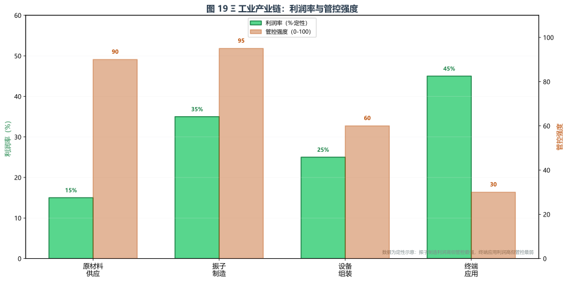

# 产业与生产

> **前置知识提示**：阅读本章前，建议先读 [力量体系总论](../08_力量体系/01_力量体系总论.md)、[体系A分类与层级](../08_力量体系/02_体系A/03_分类与层级.md) 和 [科技与工艺](03_科技与工艺.md)。本章假设读者已理解三层技术、材料库、转译接口等工程概念。
>
> **本章定位**：本文件聚焦 Ξ 技术的**经济产业维度**——产业链结构、就业规模、贸易格局、技术扩散的经济成本。它不回答"技术如何工作"，而是回答"技术如何在社会中形成产业、如何被分配和交易"。关于 f 漂移下的工程设计演化与材料工程，见 [科技与工艺](03_科技与工艺.md)。

本文件聚焦 Ξ 技术的**经济产业维度**——产业链结构、就业规模、贸易格局、技术扩散的经济成本。关于 f 漂移下的工程设计演化与材料工程，见 [科技与工艺](03_科技与工艺.md)；关于三层技术的物理原理，见 [体系A分类与层级](../08_力量体系/02_体系A/03_分类与层级.md)。

---

  
  

    Ξ 工业产业链：各环节利润率与帝国管控强度对比。振子制造利润高但管控最强，终端应用管控最弱。
  

---

## 一、Ξ 工业产业链结构

> **由浅入深**：一项技术要成为社会的基础设施，光有物理原理和工程设计是不够的。它必须形成产业链：有人采矿、有人制造、有人组装、有人销售，有人为它立法、有人为它打仗。本章从经济维度看 Ξ 技术如何在帝国时期形成完整的工业体系，以及战国时期的扩散如何改变了产业链的权力分配。这不是关于机器如何工作的章节，而是关于机器如何被生产、交易和控制的章节。

帝国时期的 Ξ 工业已形成完整的产业链，从原材料到终端应用分为四个环节：

| 环节 | 内容 | 管控级别 |
|------|------|---------|
| 原材料供应 | 关键合金（铬/镍/钼配方）、高性能陶瓷前驱体粉末 | 专卖机构统一配给，配方保密 |
| 振子制造 | 核心振子精密加工（公差控制在一根头发丝的十分之一以内） | 皇家工坊垄断，国家机密 |
| 设备组装 | 民用设备（Ξ泵/Ξ加热器）允许民间工坊生产；武器级高能振子仅军械工坊 | 许可证制度，分级管控 |
| 终端应用 | 工业（锻锤/切割器）、通讯（传讯器）、民用（排水/灌溉） | 民用放开，军用管制 |

### 帝国管控的经济逻辑

帝国工部对所有高能 Ξ 装置实行严格的许可证制度，核心原因不仅是军事安全，更是**经济控制**：

- 高能 Ξ 装置可造成大规模结构解离破坏，一旦落入地方总督之手，中央将难以控制——这是政治风险
- 核心振子制造工艺被列为国家机密，仅在皇家工坊内部传承——这是技术垄断
- 原材料供应被严格管控，关键合金配方保密，高性能陶瓷前驱体粉末专卖——这是资源控制

这三层管控使帝国中央掌握了 Ξ 工业的命脉，也使帝国末期中央控制力减弱时，技术扩散成为不可逆的趋势。

---

## 二、第一层工具的产业覆盖

第一层 Ξ 工具覆盖了帝国工业体系的核心环节，形成了一个跨行业的应用矩阵：

| 工具类型 | 工作原理 | 主要应用领域 | 经济地位 |
|----------|---------|------------|---------|
| Ξ 锻锤 | 蓄势弹簧效应将旋转动能放大为定向冲击力 | 金属加工、武器锻造 | 效率远超纯机械锻锤，帝国军工基础 |
| Ξ 加热器 | 场态热辐射实现精准局部加热 | 冶金、陶瓷烧制、玻璃加工 | 高温工业的核心设备 |
| Ξ 传讯器 | 微量溢出信号进行远距离信息传输 | 军事通讯、行政调度、商情传递 | 帝国远程通讯骨干网络 |
| Ξ 泵 | Ξ 驱动抽水 | 矿井排水、农田灌溉 | 民用基础设备，量大面广 |
| Ξ 切割器 | 定向机械力用于切割 | 石材加工、金属切割 | 建筑与制造业通用工具 |

> 各工具的技术原理与 f 漂移下的工程演化，见 [科技与工艺](03_科技与工艺.md) 与 [体系A分类与层级](../08_力量体系/02_体系A/03_分类与层级.md) 第一层章节。

---

## 三、f 漂移对产业的经济冲击

f 中心的持续漂移对 Ξ 工业造成了层层递进的经济冲击，每一次冲击都迫使产业升级：

| f 中心区间 | 产业冲击 | 经济应对 | 代价 |
|-----------|---------|---------|------|
| 300→450 | 固定调谐设备效率下降 | 旋钮调谐机构，操作者培训成本上升 | 人机关系开始异化 |
| 450→550 | 旋钮可调范围到上限 | 材料工程（熟铁→合金钢→陶瓷基→多层异质） | 材料成本上升，振子重量增加 |
| >550 | 所有机械方案失效 | 参数库时代，操作者需学"机器语" | 人才稀缺，培训速度跟不上扩张 |

**关键经济转折**：当 f 中心突破 550 时，机械升级的经济成本已经超过了转译接口的研发成本——这是第二层技术从"可选优化"变为"必需投资"的经济临界点。

> 四阶段工程演化的技术细节，见 [科技与工艺](03_科技与工艺.md)。

---

## 四、战国时期的技术扩散经济

帝国解体后，Ξ 技术的垄断体系崩溃，技术扩散带来了一系列经济后果：

### 仿生编程生态的经济碎片化

战国列国各自掌握不同的生物解码库，导致设备互不兼容——不是硬件差异，而是编码语言不通。这一技术碎片化产生了显著的经济成本：

- **重复研发**：每个国家独立开发功能相似的编码模块，造成研发资源浪费
- **设备不兼容**：缴获敌方设备后需要专门的反编译团队才能使用，军事缴获的经济价值大打折扣
- **人才壁垒**：操作者只能使用本国编码体系的设备，跨国就业不可能
- **贸易障碍**：Ξ 设备无法跨国流通，国际贸易仅限于原材料和民用低功率设备

### 民间社团的经济角色

与帝国时期的严格管控不同，战国列国为了在技术上取得优势，对民间研究的限制相对宽松。各地的秘密社团、学院、行会都投入了 Ξ 场编码研究，形成了与官方并行——有时竞争、有时合作——的技术生态。

民间社团的经济意义：
- **创新来源**：偶尔产生官方路线未曾发现的编码模式，被列国暗地里收买
- **人才储备**：为官方机构提供潜在的研究者和操作者
- **灰色经济**：部分社团涉及黑色产业链（详见 [传承体系与魔法社团](../06_政治与势力/传承体系与魔法社团.md)）

### 第三层技术的经济影响

第三层施法者的出现改变了战国的军事经济学：

- **战略资产**：一位成熟魔法师的价值相当于一支精锐部队，但培养成本（含七成死亡率）极高
- **f 塔经济学**：一座 f 塔网络的建设和维护成本相当于训练一个三层施法者，但可同时威慑多个敌方施法者，且不需要承受训练死亡率——f 塔是比魔法师更可计算、更可复制的防御投资
- **军备竞赛**：f 塔的部署迫使敌方投入更多资源培养施法者或发展反 f 塔技术，形成军备竞赛循环

> f 塔的工程实现与战略价值，见 [科技与工艺](03_科技与工艺.md) 人工 f 塔章节。第三层传承体系的组织结构，见 [传承体系与魔法社团](../06_政治与势力/传承体系与魔法社团.md)。

---

## 导航

- Ξ 技术的工程设计演化与材料工程 → [科技与工艺](03_科技与工艺.md)
- 三层技术的物理原理与分类 → [体系A分类与层级](../08_力量体系/02_体系A/03_分类与层级.md)
- 第三层传承体系的政治与组织维度 → [传承体系与魔法社团](../06_政治与势力/传承体系与魔法社团.md)
- 力量体系总览 → [力量体系总论](../08_力量体系/01_力量体系总论.md)
